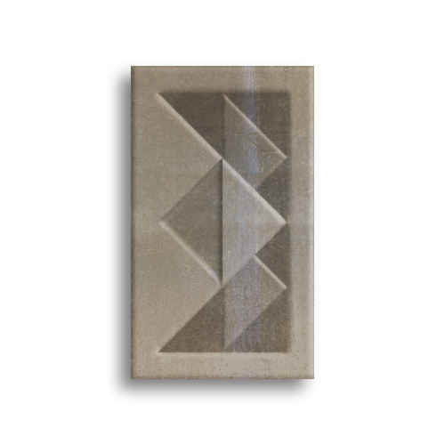

The DBB aims to protect the world from the effects of [Ergonite](Ergonite.md) depletion. They do so by tracking the location of ergonite veins, rooting out illegal or excessive mining operations, and generally pushing to keep as much of the precious material in the ground as possible.

---

### History
A millenium ago, Dwarves were major miners and exporters of ergonite. However, when a particularly large explosion destroyed an entire colony, the danger posed by ergonite mining began to sink in. This caused a lot of turmoil for the dwarves, given how much of their economy depended on ergonite exporting, but when a group of dwarves discovered the phnomenal synergy between ergonite and living things the dwarves found a new niche: Agriculture. In the modern day, dwarven governments are heavily invested in keeping ergonite in the ground, to keep the soil fertile and their crops flourishing. The DB was founded for this purpose.